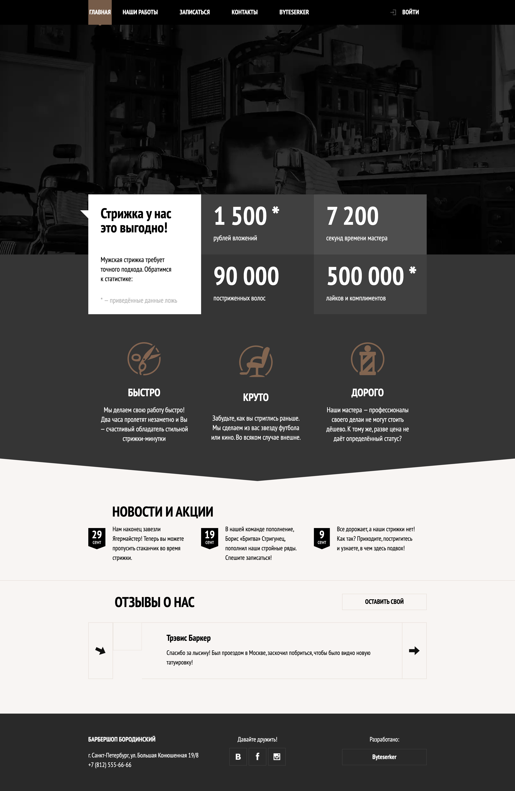

# BarbershopV2

<div align="center">


</div>

## Overview

A static, responsive barbershop website template. Built with SCSS and a Gulp-based pipeline that compiles, bundles, and optimizes assets into `docs/` for easy hosting (e.g., GitHub Pages).

## Key Features

- Responsive layout with modular SCSS partials
- Asset optimization: minified CSS/JS, image compression, and WebP generation
- Live-reload dev server powered by BrowserSync

## Tech Stack

HTML5, SCSS, JavaScript (ES6), Gulp 4, PostCSS (Autoprefixer, cssnano), Webpack 4, BrowserSync

## Architecture

Source files live in `src/` (`sass`, `js`, `img`, `*.html`). Gulp tasks compile and output production-ready assets to `docs/`, including HTML minification, CSS/JS bundling, and images (JPG/PNG/WebP).

## Performance & Accessibility

Minified bundles, PostCSS optimizations, and WebP images reduce payload size. Semantic HTML and basic ARIA patterns aim to improve keyboard and screen reader support.

## Prerequisites

- Node.js: `12.22.12`

## Installation

```bash
git clone https://github.com/Rainspistols/BarbershopV2.git
cd BarbershopV2
npm install
```

## Quick Start

```bash
npm run dev
# Production
npm run build
npm start
```

Open http://localhost:3000

## Available Scripts

- `npm run dev` – Start BrowserSync with file watching and live reload
- `npm run build` – Clean and build optimized assets into `docs/`
- `npm start` – Alias of `dev`

## Screenshots




---

<div align="center">

Built with ❤️ by [Maksym Galchenko](https://github.com/maxgalchenko)

[](https://www.linkedin.com/in/galchenko-max/)

[](https://portfolio-green-six-29.vercel.app/)

[](mailto:galchenko.maksym@gmail.com)


</div>
